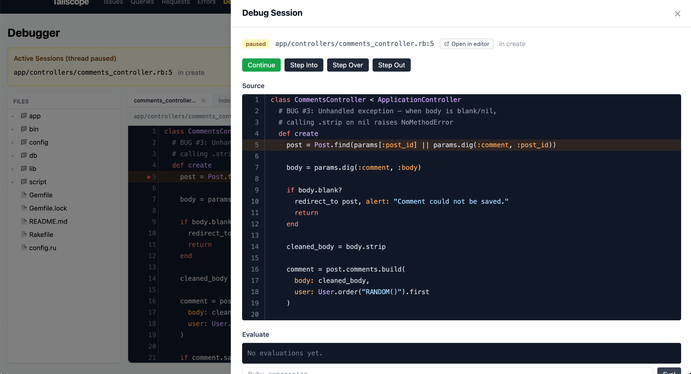

# Interactive Debugger

Tailscope includes a browser-based debugger that lets you set breakpoints, pause execution, inspect variables, evaluate expressions, and step through Ruby code — all from the web dashboard.



## Enabling the Debugger

The debugger is disabled by default because it uses Ruby's `TracePoint` API, which adds overhead to every line of Ruby executed.

Enable it in your initializer:

```ruby
Tailscope.configure do |config|
  config.debugger_enabled = true
  config.debugger_timeout = 60  # seconds before auto-continue
end
```

Restart your Rails server after changing this setting.

## Setting Breakpoints

1. Open the **Debugger** page in the Tailscope dashboard
2. Use the **file browser** to navigate your source code
3. Click the **line number gutter** to set a breakpoint on that line
4. The breakpoint appears in the breakpoints panel

Breakpoints persist across server restarts (stored in the SQLite database).

### Conditional Breakpoints

Set a condition that must evaluate to `true` for the breakpoint to pause execution:

1. Set a breakpoint as above
2. Enter a Ruby expression in the condition field (e.g., `user.id == 42` or `params[:debug]`)
3. The expression is evaluated in the binding at the breakpoint location
4. Execution only pauses when the condition returns a truthy value

## Debugging a Paused Session

When code hits a breakpoint, the request thread pauses and a debug session appears in the dashboard.

### Session Panel

The session panel shows:
- **File and line** where execution paused
- **Source code** with the current line highlighted
- **Local variables** and their current values
- **Call stack** (first 20 frames)

### Expression Evaluator

Type any Ruby expression in the evaluator input to run it in the paused execution context:

```ruby
user.email                    # inspect a variable
User.count                    # run a query
params[:id].to_i              # check request params
local_variables               # list all locals
binding.local_variable_get(:x) # alternative variable access
```

Expressions are evaluated using `binding.eval()` in the exact scope where execution paused.

### Stepping Controls

| Button | Behavior |
|--------|----------|
| **Continue** | Resume execution until the next breakpoint |
| **Step Into** | Execute one line, stepping into method calls |
| **Step Over** | Execute one line, stepping over method calls (stay at current depth) |
| **Step Out** | Continue until the current method returns |

**Step Into** pauses on the very next line of Ruby executed, even if it's inside a called method.

**Step Over** pauses on the next line at the same call depth. If the current line calls a method, the method runs to completion before pausing.

**Step Out** continues execution until the call depth decreases (the current method returns), then pauses on the line after the call.

## How It Works

### Architecture

The debugger has four components:

1. **BreakpointManager** -- Stores breakpoints in SQLite, provides thread-safe access
2. **TraceHook** -- Registers a Ruby `TracePoint` for `:line`, `:call`, and `:return` events
3. **Session** -- Represents one paused execution, holds the Ruby `Binding` object
4. **SessionStore** -- In-memory store of active and recent sessions

### Execution Flow

```
1. TracePoint fires on :line event
2. TraceHook checks if a breakpoint exists at this file:line
3. If conditional, evaluates condition in the binding
4. Creates a Session with the binding, locals, and call stack
5. Session.wait! blocks the request thread (ConditionVariable)
6. Dashboard polls /api/debugger/poll, sees the active session
7. User clicks "Step Into" → API calls session.step_into!
8. Session.signal! wakes the blocked thread
9. TraceHook enters stepping mode
10. Next :line event at correct depth → creates new Session → repeat
```

### TracePoint Events

- **`:line`** -- Fires before each line of Ruby. This is where breakpoint checks happen.
- **`:call`** -- Fires when entering a method. Used to track call depth for step over/out.
- **`:return`** -- Fires when leaving a method. Used to track call depth.

### Path Filtering

The debugger ignores events from:
- Tailscope's own code
- Gems (paths containing `/gems/`)
- Ruby internals (`<internal:`)
- Bundler paths (`/vendor/bundle/`)

This keeps the debugger focused on your application code.

## Session Timeout

If no user interaction occurs within `debugger_timeout` seconds (default: 60), the session automatically continues. This prevents a forgotten breakpoint from blocking your server indefinitely.

## Session Cleanup

Old sessions (non-paused, older than 5 minutes) are automatically cleaned up to prevent memory growth.

## Security Notes

- The debugger can only set breakpoints on files within `config.source_root`
- Expression evaluation runs arbitrary Ruby code -- this is intended for development only
- The debugger should never be enabled in production
- File browsing is restricted to `source_root`

## Performance Impact

When `debugger_enabled = true`, a `TracePoint` is active for every line of Ruby executed. This typically adds 5-20% overhead depending on the workload. The overhead is zero when disabled.

The TracePoint is only registered when at least one breakpoint exists or when stepping mode is active. If all breakpoints are removed, the TracePoint is disabled automatically.

## Troubleshooting

**Breakpoint doesn't pause:**
- Verify `config.debugger_enabled = true` and restart the server
- Check that the breakpoint file path matches the actual file (no symlinks)
- Ensure the line contains executable Ruby (not a comment or blank line)
- For conditional breakpoints, verify the condition expression is valid

**Session times out too quickly:**
- Increase `config.debugger_timeout`

**Server feels slow with debugger on:**
- This is expected. Disable `debugger_enabled` when not actively debugging.
