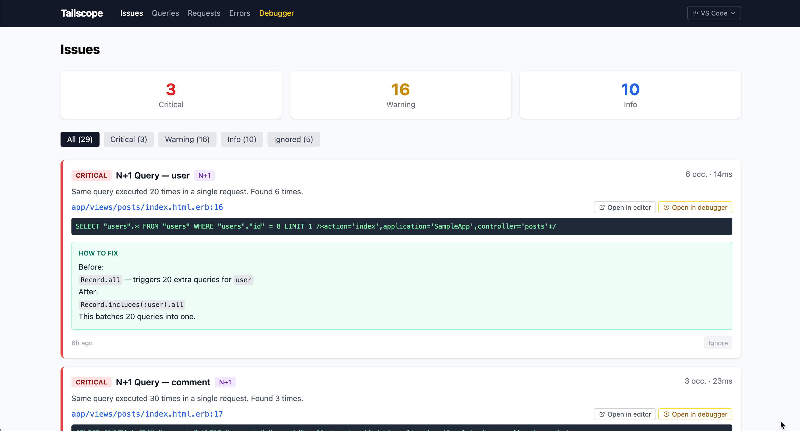
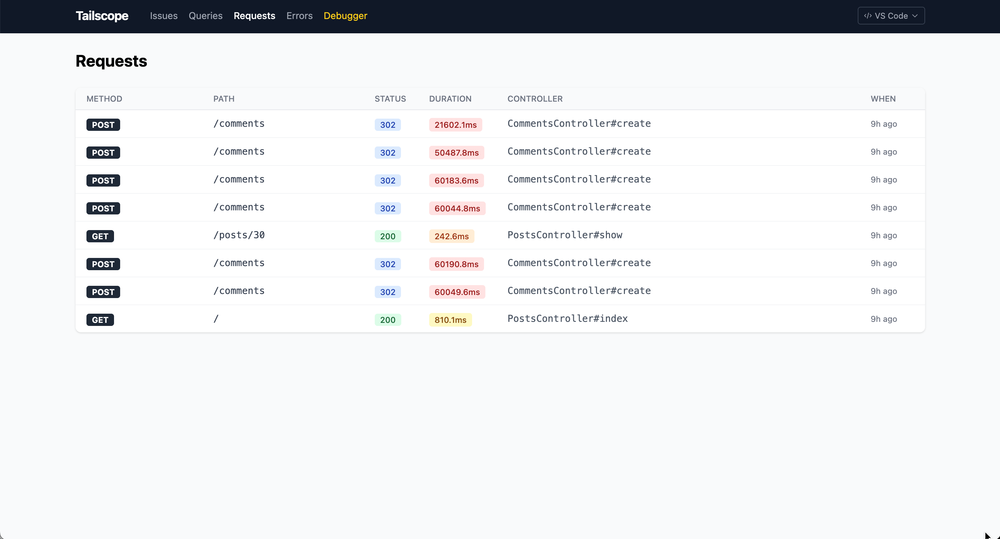

# Web Dashboard

The Tailscope web dashboard is a React single-page application mounted at `/tailscope` in your Rails app. It provides a visual interface for browsing captured issues, queries, requests, errors, and debugging sessions.

## Accessing the Dashboard

Visit `http://localhost:3000/tailscope` (or wherever your Rails app runs). The dashboard is only accessible when `config.enabled` is `true`.

## Pages

Navigation headings for **Queries** and **Errors** display live item counts.

### Issues

The default landing page. Shows an aggregated view of all detected problems across all categories.

**Features:**
- Severity filter tabs: All, Critical, Warning, Info
- Issue cards with title, description, occurrence count, and total duration
- Suggested fix with before/after code examples
- Inline source code viewer
- "Open in Editor" button
- Ignore/unignore issues to hide known problems

**Issue types:**
- N+1 query patterns
- Slow queries (grouped by source location)
- Slow requests (grouped by controller#action)
- Error patterns (grouped by exception class and location)
- Code smells (from static analysis)

**Ignored issues:** Click the ignore button on any issue to hide it. Switch to the "Ignored" tab to see and restore ignored issues.

### Queries

Lists individual slow SQL queries ordered by most recent.

**Columns:**
- SQL text (truncated, expandable)
- Duration in milliseconds
- Source file and line
- N+1 indicator with count
- Recorded timestamp

**Filtering:**
- Toggle "N+1 only" to show only N+1 pattern queries

**Detail drawer:** Click any query to open a side drawer showing:
- Full SQL text
- Duration and timing
- Source location with code context
- Request ID (links to associated request)

### Requests

Lists individual slow HTTP requests ordered by most recent.

**Columns:**
- HTTP method and path
- Status code
- Total duration
- View render time
- Database time
- Controller#action

**Detail drawer:** Click any request to see:
- Full request details and params
- Breakdown: total, view, DB time
- Associated queries (all SQL executed during this request)
- Associated errors (any exceptions during this request)

### Errors

Lists captured exceptions ordered by most recent.

**Columns:**
- Exception class
- Message (truncated)
- Source file and line
- HTTP method and path
- Recorded timestamp

**Detail drawer:** Click any error to see:
- Full exception message
- Backtrace
- HTTP context (method, path, params)
- Source code at the error location

### Debugger

Interactive breakpoint debugger. Requires `config.debugger_enabled = true`.

**Features:**
- File browser to navigate your source code
- Set breakpoints on any line by clicking the gutter
- Conditional breakpoints (Ruby expression evaluated at break time)
- Active session panel shows paused execution points
- Variable inspector for local variables
- Expression evaluator
- Step controls: Step Into, Step Over, Step Out, Continue

See [Debugger](debugger.md) for detailed usage.

### Tests

Browser-based RSpec test runner.

**Spec file tree:**
- Folder and file hierarchy mirroring your `spec/` directory
- Category badges (MODEL, CTRL, JOB, etc.) on each spec file
- Expand a file to see its describe/context/it groups as a nested tree
- Dry-run discovery: expanding a file fetches examples via `rspec --dry-run` without executing them

**Running specs:**
- **Run All** button to run the entire suite
- Play button on any folder, file, context group, or individual example
- Pass/fail dot indicators at every level (file, group, example)
- Auto-expand files with results after a run completes

**Results drawer:**
- **Results tab** — hierarchical pass/fail breakdown per file, with describe/context nesting
- **Console tab** — full RSpec output with ANSI color rendering (green dots, red F, colored diffs)
- Summary bar: total, passed, failed, pending counts and duration

**Integration:**
- View Source button (`</>`) opens a side drawer showing the file at the exact line
- Open in Editor button from the drawer to jump to your editor
- Open in Debugger button to set a breakpoint at that line

**Persistence:**
- Expanded/collapsed folder and file state persists across page reloads via LocalStorage

### Jobs

Monitors background job executions captured via the ActiveJob subscriber.

**Columns:**
- Job class name
- Queue name
- Duration
- Timestamp

**Detail drawer:** Click any job to see:
- Job class, queue, and arguments
- Duration and timestamps
- Trace information and associated queries

## Source Code Viewer

Available throughout the dashboard wherever a source location is shown. Opens as a side drawer displaying:
- Line numbers
- Highlighted current line
- Surrounding context (50 lines above and below by default, configurable via `radius` parameter)
- Syntax-highlighted Ruby code

## Open in Editor

A button appears next to every source location. Clicking it opens the file at the exact line in your configured editor. See [Editor Integration](editor-integration.md) for setup.

## Pagination

All list pages (Queries, Requests, Errors, Jobs) are paginated with 25 items per page. Navigation controls appear at the bottom of each list.
